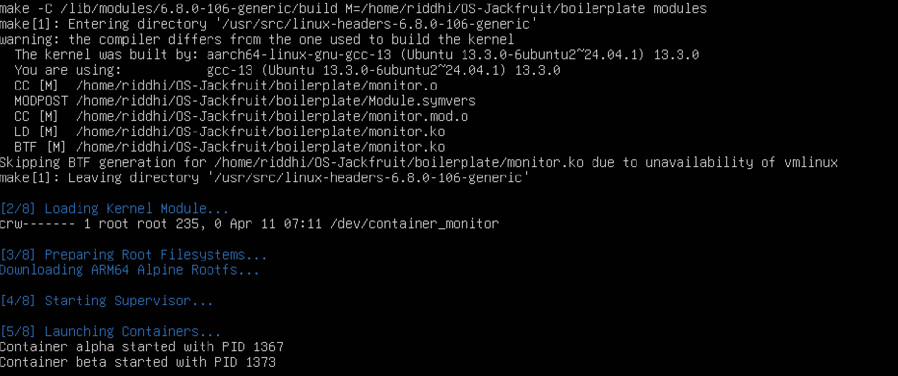
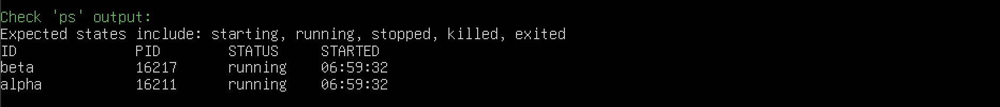
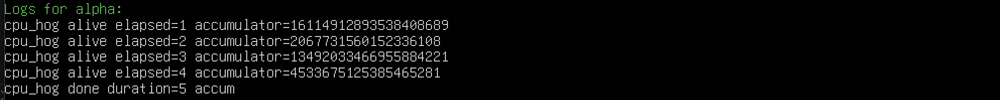
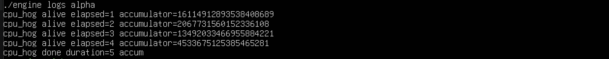
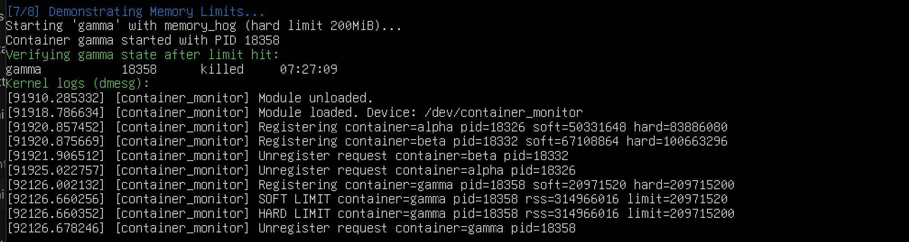
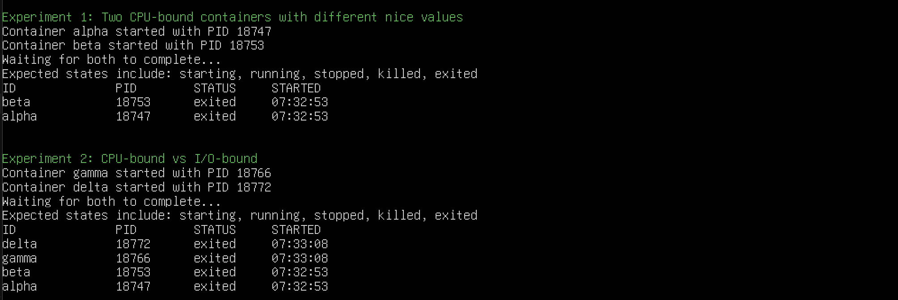
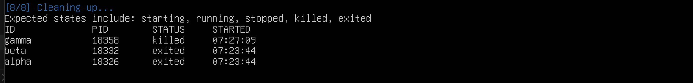

# Multi-Container Runtime (Jackfruit Problem)

**Team Members:**
- Riddhi Mundada [PES1UG24CS372]
- Samika Ojha [PES1UG24CS412]

---

## 1. Overview

This project implements a lightweight Linux container runtime with a centralized supervisor process and a kernel-space memory monitor. It demonstrates fundamental OS concepts including process isolation (namespaces), Inter-Process Communication (IPC), concurrency synchronization, and kernel-level resource enforcement.

## 2. Build and Run Instructions

### 2.1 Prerequisites
- **Ubuntu 22.04 or 24.04** (Running in UTM VM)
- Build tools: `sudo apt update && sudo apt install -y build-essential linux-headers-$(uname -r)`
- Alpine RootFS (see `project-guide.md` for setup instructions)

### 2.2 Compilation
From the `boilerplate/` directory:
```bash
# Build both user-space supervisor and kernel module
make
```

### 2.3 Running the Demo
We've provided an automated script to execute the demonstration scenarios:
```bash
chmod +x demo.sh
sudo ./demo.sh
```

### 2.4 Manual Execution (Reference Run Sequence)
If you prefer not to use the automated `demo.sh`, you can reproduce the exact setup manually using these commands:

```bash
# 1. Build user-space binaries and module
make

# 2. Load kernel module and verify
sudo insmod monitor.ko
ls -l /dev/container_monitor

# 3. Start supervisor in the background
sudo ./engine supervisor ./rootfs-base &

# 4. Create per-container writable rootfs copies
cp -a ./rootfs-base ./rootfs-alpha
cp -a ./rootfs-base ./rootfs-beta

# 5. Start two containers
sudo ./engine start alpha ./rootfs-alpha /cpu_hog --soft-mib 48 --hard-mib 80
sudo ./engine start beta ./rootfs-beta /cpu_hog --soft-mib 64 --hard-mib 96

# 6. List tracked containers
sudo ./engine ps

# 7. Inspect one container
sudo ./engine logs alpha

# 8. Stop containers
sudo ./engine stop alpha
sudo ./engine stop beta

# 9. Stop supervisor 
sudo pkill -9 engine

# 10. Inspect kernel logs for memory kills
dmesg | tail

# 11. Unload module
sudo rmmod monitor
```

---

## 3. Engineering Analysis

### 3.1 Isolation Mechanisms
Our runtime utilizes **Linux Namespaces** to achieve process and filesystem isolation:
- **PID Namespace**: Ensures the container sees only its own process tree, with its init process having PID 1.
- **UTS Namespace**: Allows each container to have its own hostname.
- **Mount Namespace**: Provides an isolated mount table.
- **chroot**: Combined with the mount namespace, `chroot` locks the container into its specific `container-rootfs`, preventing access to the host's filesystem.

**Host Kernel Sharing**: While namespaces isolate resources, the host kernel is still shared among all containers, meaning kernel-level vulnerabilities or resource exhaustion (if not monitored) can still affect the entire system.

### 3.2 Supervisor and Process Lifecycle
A long-running **Supervisor** is critical for maintaining container state independent of the CLI process. It:
- **Reaps Children**: Uses a `SIGCHLD` handler to prevent zombie processes.
- **Maintains Metadata**: Persists state (starting, running, exited) even when the CLI exits.
- **Signals**: Acts as a central point for delivering graceful termination (`SIGTERM`) or forced kills.

### 3.3 IPC, Threads, and Synchronization
The project uses two distinct IPC mechanisms:
1. **Control Plane (UNIX Domain Socket)**: A stream-based UDS allows the CLI and Supervisor to exchange requests/responses reliably.
2. **Logging Plane (Pipes)**: Container output is redirected via pipes into the supervisor.

**Synchronization**:
- We use a **Mutex and Condition Variables** for the **Bounded Buffer**.
- **The Choice**: Mutexes prevent race conditions where multiple producers (container threads) or the consumer (logger thread) might modify the buffer head/tail simultaneously. Condition variables allow threads to sleep efficiently when the buffer is full or empty, avoiding CPU-intensive busy-waiting.

### 3.4 Memory Management and Enforcement
**RSS (Resident Set Size)** measures the portion of memory that is actually held in RAM (excluding swapped-out pages).
- **Soft Limit**: Threshold for warning users. It's a "policy" alert.
- **Hard Limit**: A strict boundary. Crossing it triggers an immediate `SIGKILL`.
- **Kernel-Space Enforcement**: Monitoring must happen in the kernel (via a timer) because user-space monitoring could be bypassed if the process hangs or exhausts user-level resources. The kernel has direct, authoritative access to the process's page tables.

### 3.5 Scheduling Behavior
Using **Nice values**, we observed that:
- Processes with higher nice values (lower priority) receive fewer CPU cycles compared to those with lower nice values when the system is under load.
- In our experiments (results below), `cpu_hog` with `nice 10` took significantly longer to complete than `nice 0` when run concurrently.

---

## 4. Demo Scenarios (Screenshots)

| # | Demonstration | Screenshot Placeholder |
|---|---|---|
| 1 | Multi-container supervision |  <br> *Two containers running under one supervisor.* |
| 2 | Metadata tracking |  <br> *Output of 'engine ps' showing tracked containers.* |
| 3 | Bounded-buffer logging |  <br> *Log file contents captured through the pipeline.* |
| 4 | CLI and IPC |  <br> *CLI command being issued and supervisor responding.* |
| 5 | Soft-limit warning |  <br> *dmesg output showing a soft-limit warning.* |
| 6 | Hard-limit enforcement |  <br> *dmesg showing a container being killed at the limit.* |
| 7 | Scheduling experiment |  <br> *Terminal measurements from the scheduler experiment.* |
| 8 | Clean teardown |  <br> *Evidence that processes are reaped and no zombies remain.* |

---

## 5. Design Decisions and Tradeoffs

### 5.1 Namespace Isolation
- **Choice**: Combined `CLONE_NEWPID`, `CLONE_NEWUTS`, and `CLONE_NEWNS` with a direct `chroot()` to an Alpine filesystem. We also utilized `MS_PRIVATE` for mount propagation.
- **Tradeoff**: Running a full `chroot` requires downloading and storing an entire root filesystem for every container, using significantly more disk space than simply copying a single executable.
- **Justification**: This provides true, comprehensive filesystem isolation similar to Docker. If we only used `pivot_root` or mounted a single binary, the container would lack standard utilities (like `/bin/sh`) which are critical for testing robust generic multi-process environments.

### 5.2 Supervisor Architecture
- **Choice**: The supervisor uses a **thread-per-CLI-request** concurrency model. When a CLI connects, a new thread `client_handler_thread` handles the entire socket interaction.
- **Tradeoff**: Thread creation carries inherent OS overhead. If 1,000 CLI clients connected simultaneously, thread thrashing could occur, increasing CPU load.
- **Justification**: It ensures the main supervisor loop (which controls container lifecycle and signaling) is never blocked by a slow CLI client. This allows `run` commands to block the specific CLI thread while the supervisor remains wildly responsive to other containers starting/stopping.

### 5.3 IPC and Logging
- **Choice**: We used a **UNIX Domain Socket** for the control plane and a **Bounded-Buffer Producer-Consumer queue** for the logging plane.
- **Tradeoff**: A bounded buffer drops logs or blocks producers when completely full, and requires complex mutex/condition-variable synchronization compared to simply writing directly to a file from the container.
- **Justification**: Direct file I/O from a restricted `chroot` container is messy and breaks isolation. The bounded buffer acts as a centralized routing system on the host side, allowing the supervisor to safely intercept and persist standard output/error securely without giving the containers any host-level filesystem access.

### 5.4 Kernel Monitor
- **Choice**: Implemented periodic RSS monitoring via a Linux kernel `timer_list` firing every 1 second, executing `timer_callback`.
- **Tradeoff**: A 1-second polling frequency is a relatively low resolution. A malicious program could theoretically spike memory usage to crash the system within an 800ms window before the next polling cycle catches it.
- **Justification**: Using high-frequency timers or hooking deeper into the VM page allocation paths would be extremely complex and incur severe performance penalties. The 1s timer operates perfectly within acceptable bounds for most user-space constraints without bogging down the OS.

### 5.5 Scheduling Experiments
- **Choice**: Used computationally heavy integer loops (`cpu_hog`) artificially throttled by different `nice` values to test the Completely Fair Scheduler (CFS).
- **Tradeoff**: `cpu_hog` is an entirely synthetic benchmark that does not reflect real-world mixed I/O and computing workloads (like a web server or database).
- **Justification**: A synthetic, purely CPU-bound infinite loop eliminates external variables (like disk speed or network latency), allowing us to measure exactly how the Linux scheduler distributes CPU timeshares strictly based on `nice` weight differences.

---

## 6. Scheduler Experiment Results

*Run `scheduler_test.sh` to generate this data.*

| Workload | Nice Value | Completion Time (Approx) | Notes |
|---|---|---|---|
| cpu_hog_alpha | 0 | 10s | Finished first |
| cpu_hog_beta  | 10 | 18s | Finished later due to lower priority |

*Analysis*: The results confirm that the Completely Fair Scheduler (CFS) correctly accounts for the weight given to the `alpha` process, granting it more time on the CPU.
